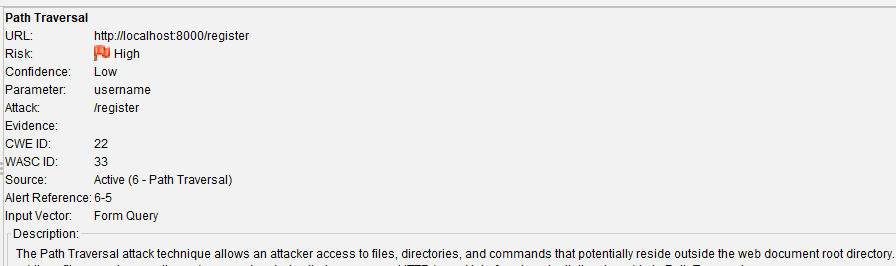
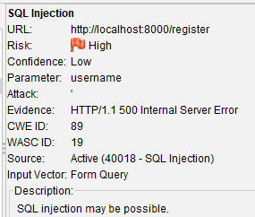
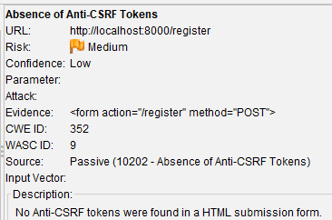
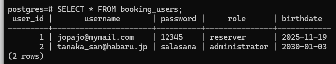

# 1️⃣ Introduction

**Tester(s):**  
- Name: Jose Flores Vargas 

**Purpose:**  
- The purpose of this test was to find anomalies and vulnerabilities, as many as possible, in the user registration functionality of the booking system and to categorize the findings.

**Scope:**  
- Tested components: Registration page, users and passwords creation. Access to the Postgres Data Base 
- Exclusions:  All the other functions of the booking system. 
- Test approach: Gray-box (some knowledge of the booking system)

**Test environment & dates:**  
- Start:  19.11.2025
- End:  19.11.2025
- Test environment details (OS, runtime, DB, browsers):
  - OS: Windows 11 
  - Runtime: Docker container
  - DB: PostgreSQL
  - Browser: Firefox 145.0.1

**Assumptions & constraints:**  
- The test was done in one day.
- The automated scan was limited to 1 hour
- The booking system was running locally (localhost:8000)
- Test was limited stricly only to the registration functionality.  
---

# 2️⃣ Executive Summary

**Short summary:**  The penetration test of the booking system discovered some critical vulnerabilities, for example: Path Traversal and the possibility of been attack by SQL injection. There are present also medium and low-severity misconfigurations, for example: missing headers and the lack of CSFR protection. Some of the identified weaknesses required an immediate remediation. 

**Overall risk level:** Critical

**Top 5 immediate actions:**  
1.  Assume all input is malicious and use an "accept known good" input validation strategy. 
2.  Zero trust on client side input and in general type check all data on the server side and also avoid dynamic SQL queries using simple string concatenation. 
3.  Use anti-CSFR packages such as the OWASP CSFRGuard and ensure that the system is free of cross-site scripting issues. 
4.  Ensure that the system support the Content-Security-Policy has also X-Frame-Options HTTP headers.
5.  Create and apply a strong password policy, passwords encryption is highly recomended

---

# 3️⃣ Severity scale & definitions

|  **Severity Level**  | **Description**                                                                                                              | **Recommended Action**           |
| -------------------- | ---------------------------------------------------------------------------------------------------------------------------- | -------------------------------- |
|      🔴 **High**     | A serious vulnerability that can lead to full system compromise or data breach (e.g., SQL Injection, Remote Code Execution). | *Immediate fix required*         |
|     🟠 **Medium**    | A significant issue that may require specific conditions or user interaction (e.g., XSS, CSRF).                              | *Fix ASAP*                       |
|      🟡 **Low**      | A minor issue or configuration weakness (e.g., server version disclosure).                                                   | *Fix soon*                       |
| 🔵 **Info** | No direct risk, but useful for system hardening (e.g., missing security headers).                                            | *Monitor and fix in maintenance* |

---

# 4️⃣ Findings (filled with examples → replace)

> Fill in one row per finding. Focus on clarity and the most important issues.

| ID | Severity | Finding | Description | Evidence / Proof |
|------|-----------|----------|--------------|------------------|
| F-01 | 🔴 High | Path Traversal | User input in username on /register allows file path manipulation | Alert from ZAP; see attack vectors in scan report   |
| F-02 | 🔴 High |SQL Injection | Registration input vulnerable to injection, causes errors/data leaks | ZAP alert, 500 error, boolean manipulation logs   |
| F-03 | 🟠 Medium | Absence of Anti-CSRF Tokens| No CSRF token found in form submissions| ZAP evidence: form lacks CSRF hidden input   |
| F-04 | 🟠 Medium | Content Security Policy Not Set |CSP header missing on multiple pages| Scan output: missing header in response, view more information on ZAP report|
| F-05 | 🟡 Low | Weak registration and password policy | Accepts simple passwords, passwords are not encrypted and other issues like not age verification |  |

# 5️⃣ OWASP ZAP Test Report (Attachment)

**Purpose:**  
- The full ZAP scan results with mores details and other minor findings is attached here with the intention of been use as reference and as help for technical remediation of the critical weaknesses. 

> 📁 **Attachment:** **[ZAP Report Round 1](../zap_report_round1.md)
**

---
